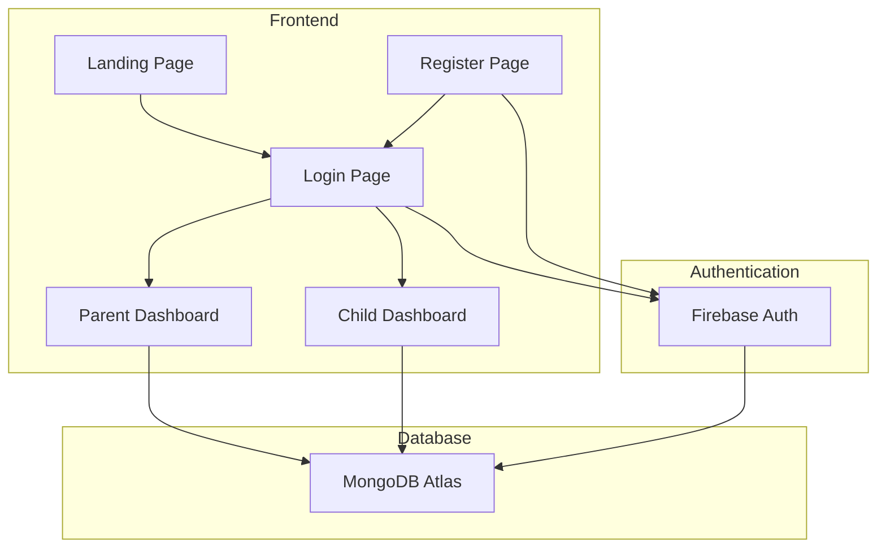

# Piggybanks.app - System Architecture

## 1. System Overview



## 2. Database Schema (MongoDB)

### Collections:

#### `users` Collection
```javascript
{
  _id: ObjectId,
  firebaseUid: String,          // Firebase UID for parents
  email: String,                 // Parent email
  role: "parent",                // User role
  name: String,                  // Parent name
  children: [ObjectId],          // References to child accounts
  createdAt: Date,
  updatedAt: Date
}
```

#### `children` Collection
```javascript
{
  _id: ObjectId,
  parentId: ObjectId,            // Reference to parent
  username: String,              // Unique username for child
  pin: String,                   // Hashed 4-digit PIN
  name: String,                  // Child's name
  balance: Number,               // Current balance
  createdAt: Date,
  updatedAt: Date
}
```

#### `transactions` Collection
```javascript
{
  _id: ObjectId,
  childId: ObjectId,             // Reference to child account
  parentId: ObjectId,            // Reference to parent account
  type: String,                  // "deposit", "withdrawal", "transfer"
  status: String,                // "completed", "pending", "rejected"
  amount: Number,
  description: String,
  fromChildId: ObjectId,         // For transfers (optional)
  toChildId: ObjectId,           // For transfers (optional)
  approvedBy: ObjectId,          // Parent who approved (optional)
  approvedAt: Date,              // Approval timestamp (optional)
  createdAt: Date,
  updatedAt: Date
}
```

## 3. User Flows

### Parent Flow:
1. **Registration**: Parent creates account with email/password via Firebase
2. **Login**: Authenticate with Firebase
3. **Dashboard Access**: 
   - Create child accounts (username + 4-digit PIN)
   - View all children and their balances
   - Add money to child accounts
   - Approve/reject withdrawal and transfer requests
   - View transaction history for all children

### Child Flow:
1. **Login**: Enter username and 4-digit PIN
2. **Dashboard Access**:
   - View current balance
   - View transaction history
   - Request withdrawal
   - Request transfer to sibling
   - See pending requests status

## 4. API Endpoints (Client-side JavaScript Functions)

### Authentication
- `registerParent(email, password, name)` - Firebase Auth
- `loginParent(email, password)` - Firebase Auth
- `loginChild(username, pin)` - Custom authentication
- `logout()` - Clear session

### Parent Operations
- `createChild(parentId, childName, username, pin, initialBalance)`
- `getChildren(parentId)` - Get all children for a parent
- `addMoney(parentId, childId, amount, description)`
- `getPendingRequests(parentId)` - Get all pending requests
- `approveRequest(requestId, parentId)`
- `rejectRequest(requestId, parentId)`

### Child Operations
- `getChildInfo(childId)` - Get child details and balance
- `requestWithdrawal(childId, amount, description)`
- `requestTransfer(fromChildId, toChildId, amount, description)`
- `getTransactionHistory(childId)`

### Shared Operations
- `getTransaction(transactionId)`
- `getTransactionsByChild(childId)`

## 5. Security Considerations

1. **Authentication**:
   - Parents: Firebase Auth with email/password
   - Children: Username + PIN (hashed in database)
   - Session management with JWT tokens

2. **Authorization**:
   - Parents can only access their own children's data
   - Children can only access their own data
   - All sensitive operations require parent approval

3. **Data Protection**:
   - PIN numbers hashed using bcrypt
   - HTTPS for all communications
   - Input validation and sanitization
   - Rate limiting for login attempts

## 6. Technology Stack

- **Frontend**: HTML5, CSS3, Vanilla JavaScript
- **Authentication**: Firebase Authentication
- **Database**: MongoDB Atlas
- **API Communication**: MongoDB Realm Web SDK or REST API
- **Hosting**: Static hosting (Firebase Hosting, Netlify, or similar)

## 7. File Structure

```
piggybanks-app/
├── index.html            # Landing page
├── login.html            # Unified login page
├── register.html         # Parent registration
├── dashboard.html        # Dynamic dashboard
├── css/
│   └── styles.css        # Main stylesheet
├── js/
│   ├── config.js         # Configuration (Firebase, MongoDB)
│   ├── auth.js           # Authentication logic
│   ├── db.js             # Database operations
│   ├── dashboard.js      # Dashboard functionality
│   ├── parent.js         # Parent-specific functions
│   └── child.js          # Child-specific functions
└── assets/
    └── logo.png          # App logo
```

## 8. Development Phases

### Phase 1: Setup and Basic Structure
- Project setup
- HTML page structures
- CSS styling
- Firebase and MongoDB configuration

### Phase 2: Authentication
- Parent registration/login
- Child login system
- Session management

### Phase 3: Core Features
- Child account creation
- Balance management
- Transaction recording

### Phase 4: Advanced Features
- Withdrawal requests
- Transfer requests
- Approval workflow

### Phase 5: Polish and Testing
- Error handling
- User feedback
- Testing all flows
- Security review